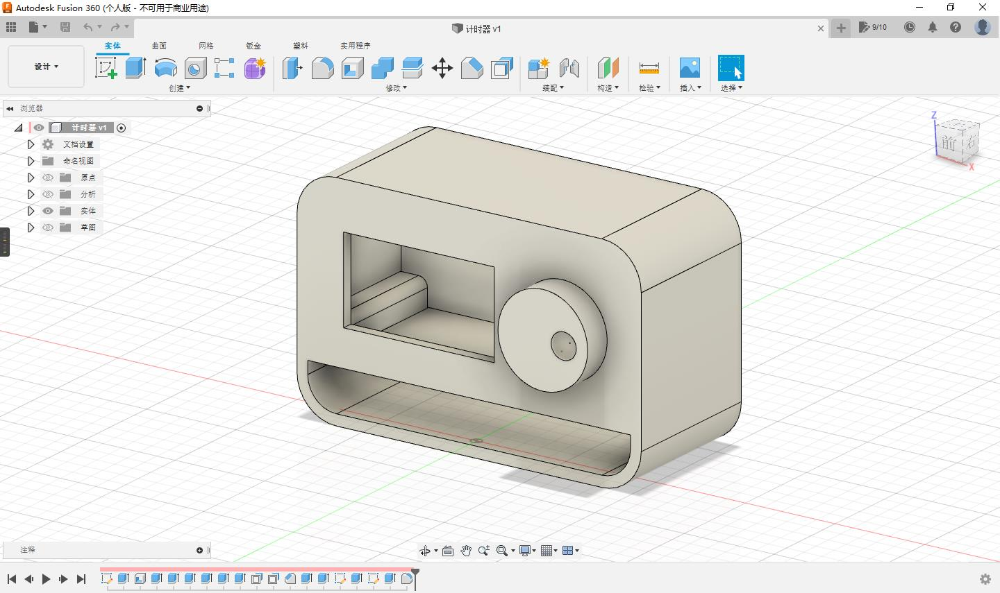

# TIMER

这是一个特立独行的计时器。This is a unique TIMER.

这个项目的起因是学习的时候经常按耐不住玩手机的心态，需要一个定时装置，来保持紧张感。

因为不是专业人士，代码和PCB显得相当业余，欢迎大佬们批评

## 硬件资源HARDWARE

- 单片机MCU：STC8H1K08
- 电源LDO：ME6211
- 锂电管理CHARGE：TP4056
- 屏幕LCD：ST7567液晶屏（老王店的垃圾屏）
- 时钟芯片RTC：DS1302
- 其他OTHER：旋转编码器

## 软件资源SOFTWARE

- 整体框架采用[ECBM-Lite库](https://gitee.com/ecbm/ecbm-library-lite)
- VSCode和[EIDE](https://github.com/github0null/eide)协同开发
- 

## 功能FUCTION

- 倒计时
- 正计时
- 时钟
- 因为有时钟芯片时钟相关的都能实现
